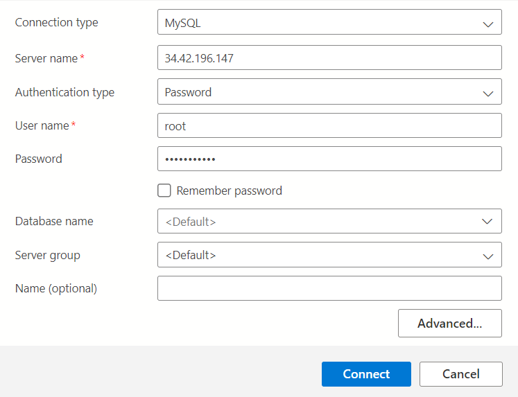
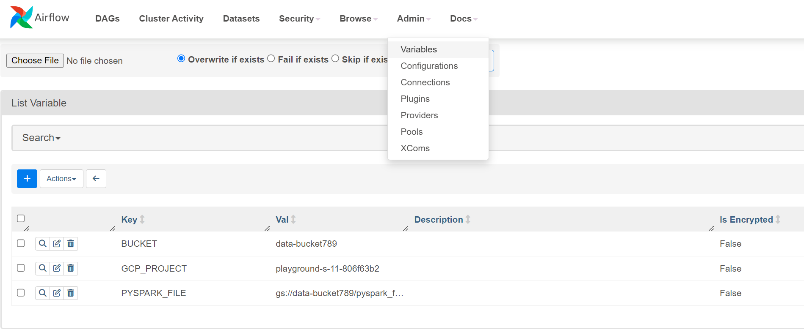

# Cloud Data Processing Pipeline

This repository contains code for two data pipelines designed to process and manage both file data and transactional data. The file data pipeline handles ingestion and transformation of data from parquet files, while the transactional data pipeline focuses on processing structured data typically stored in databases.

1. [Azure Databricks pipeline](#azure_data_pipeline).
2. [Transactional data to bigquery](#transactional-data-to-bigquery).
3. [File data to Bigquery](#file-data-to-bigquery).

## --> AZURE DATABRICKS PIPELINE <a id="azure_data_pipeline"></a>

## --> TRANSACTIONAL DATA TO BIGQUERY <a id="transactional-data-to-bigquery"></a>

This pipeline fetches data from the MySql transactional database after transformation it loads data into bigquery.

## Table of Contents

* [Overview](#transactional-data-overview)
* [Features](#transactional-data-features)
* [Components](#transactional-data-components)
* [Usage](#transactional-data-usage)
* [Pipeline Architecture](#transactional-data-pipeline-architecture)
* [Youtube](#youtube)

## Overview <a id="transactional-data-overview"></a>

In this pipeline we have transactional data which appended every hour, to load this data into warehouse we orchestrate a pipeline in apache airflow which create dataproc cluster and submits a pyspark job which fetches data from cloudSQL and after some transformation it loaded data into bigquery after the completion of this process dataproc cluster deleted to avoid undesired charges.

## Features <a id="transactional-data-features"></a>

* Fully automated scheduled pipeline.
* Creates DataProc cluster.
* Submits Pyspark job.
* Waits till job completed.
* Deleted the cluster after completion of job.
* Contains each and every file which use in this project.

## Components <a id="transactional-data-components"></a>

* CloudSQL(MySQL) instance which uses to store all transactional data.
* Compute Engine uses as Apache Airflow server.
* VPC Network used to provide connectivity between services.
* DataProc is used to process Pyspark jobs.
* BigQuery is used as a warehouse to store processed data.
* CloudStorage is used to store jar and pyspark files.

## Usage <a id="transactional-data-usage"></a>

1. Clone the repository.
2. Set up Google Cloud Platform (GCP) project.
3. Enable necessary APIs:  Google Cloud Dataproc,Google CloudSQL, Google Cloud Storage, Google BigQuery.
4. Allocate private IP range.
5. Run gcloud command to create CloudSQL instance

    ```bash
    gcloud sql instances create transactional-data --availability-type=zonal --authorized-networks 202.59.12.0/24 --database-version=MYSQL_8_0 --region=us-central1 --root-password=Karachi.321 --network default --edition=enterprise --cpu=2 --memory=8 --storage-type=SSD --storage-size=10 
    ```

6. Run DDL statements to create database and table schema in bigquery.

    ```SQL
    CREATE SCHEMA planes;
    CREATE TABLE planes.planes
    ( 
      pri_key int ,
      tailnum STRING,
      year INT64,
      type STRING,
      manufacturer STRING,
      model STRING,
      engines INT64,
      seats INT64,
      speed STRING,
      engine STRING
    );

    CREATE TABLE planes.config_table
    (
      check_mark int,
      config_data STRING
    );

    ```

7. Create cloudstorage bucket with globally unique name and after creation create two folder
    -jars
    -pyspark_files
8. insert config data into bigquery table `planes.config_table` using DML statement. Change this configuration according to your details.

      ```SQL
    insert into planes.config_table
    (
      check_mark,
      config_data
    )
    values(
      0,
      '{"jdbc_hostname": "10.27.144.3", "jdbc_port": 3306,"database":"planes","username":"root","password":"Karachi.321","table_":"planes","bucket":"databb_bucket789"}'
    )
      ```

9. upload JAR files to jar folder 
      * [gcs-connector-hadoop2-2.1.1.jar](jars/gcs-connector-hadoop2-2.1.1.jar)
      * [mysql-connector-java-8.0.13.jar](jars/mysql-connector-java-8.0.13.jar)
      * [protobuf-java-3.6.1.jar](jars/protobuf-java-3.6.1.jar)
      * [spark-2.4-bigquery-0.36.1.jar](jars/spark-2.4-bigquery-0.36.1.jar)
      * [spark-3.5-bigquery-0.36.1.jar](jars/spark-3.5-bigquery-0.36.1.jar)

10. If your cloudSQL instance created then connect it with any mysql instance like Azure data studio. Use your instance external IP to connect.
    
11. Run DDL statements to create cloudsql database and table.

    ```SQL
    CREATE DATABASE planes;

    use planes;

    CREATE TABLE planes
    (   
        pri_key int PRIMARY KEY,
        tailnum varchar(255) NOT NULL ,
        year SMALLINT,
        type varchar(255),
        manufacturer varchar(255),
        model varchar(255),	
        engines SMALLINT,	
        seats SMALLINT,	
        speed varchar(255),	
        engine VARCHAR(255)

    );
    ```

12. Insert dummy data on your transactional database using [inserting_script_file_to_database.py](src/extras/inserting_script_file_to_database.py).
13. Create compute engine instance for Apache Airflow using below script. Must change your poroject name and service account number from below script.

      ```BASH
      gcloud compute instances create my-instance --project=playground-s-11-806f63b2 --zone=us-central1-a --machine-type=e2-custom-2-8192 --network-interface=network-tier=PREMIUM,stack-type=IPV4_ONLY,subnet=default --maintenance-policy=MIGRATE --provisioning-model=STANDARD --service-account=768546597619-compute@developer.gserviceaccount.com --scopes=https://www.googleapis.com/auth/cloud-platform --tags=http-server,https-server --create-disk=auto-delete=yes,boot=yes,device-name=my-instance,image=projects/debian-cloud/global/images/debian-12-bookworm-v20240213,mode=rw,size=20,type=projects/playground-s-11-806f63b2/zones/us-central1-a/diskTypes/pd-balanced --no-shielded-secure-boot --shielded-vtpm --shielded-integrity-monitoring --labels=goog-ec-src=vm_add-gcloud --reservation-affinity=any
    ```

14. Create firewall rule to access airflow webserver from your local instance.

      ```BASH
      gcloud compute --project=playground-s-11-806f63b2 firewall-rules create airflow --direction=INGRESS --priority=1000 --network=default --action=ALLOW --rules=tcp:8080 --source-ranges=202.59.12.0/24

      ```

15. Install airflow using below scripts on your compute engine instance.

    ```BASH
      sudo apt install python3.11-venv
      python3 -m venv airflow_env
      source airflow_env/bin/activate
      pip install apache-airflow[gcp]
      airflow db init
      airflow users create --username root --password Karachi.321 --role Admin --firstname hams --lastname 42 --email abc@gmail.com
      airflow webserver -p 8080 
      airflow scheduler
      cd airflow
      mkdir dags

    ```

16. Set environment variable in airflow using [variables.json](scripts/transactional_data/apache_airflow/variables.json)
  
17. Copy dags from your local directory to compute engine directory inside `dags` folder.

    ```BASH
    gcloud compute scp "E:\workspace\Orchestrate ETL pipeline\mysql-pandas\dags\pipeline.py" my-instance:/home/hamma/airflow/dags

    ```

18. Triggers a dag manually or schedule it to trigger automatically.

19. After successful completion you will see your transformed data into bigquery.

## Pipeline Architecture <a id="transactional-data-pipeline-architecture"></a>

## --> FILE DATA TO BIGQUERY <a id="file-data-to-bigquery"></a>

Reads data from parquet file and load data into bigquery.

## Table of Contents 

* [Overview](#file-data-overview)
* [Features](#file-data-features)
* [Components](#file-data-components)
* [Usage](#file-data-usage)
* [Pipeline Architecture](#file-data-pipeline-architecture)
* [Youtube](#file_data_bigquery)

## Overview <a id="file-data-overview"></a>

The Cloud Data Processing Pipeline automates the processing of data files stored in a cloud storage bucket using Google Cloud Platform services. The pipeline is orchestrated by Google Cloud Composer and utilizes Google Cloud Dataproc, PySpark, Google BigQuery, and Google Cloud Storage.

## Features <a id="file-data-features"></a>

* Automatically processes data files stored in a cloud storage bucket.
* Orchestrates a PySpark cluster on Google Cloud Dataproc.
* Executes PySpark jobs to extract and transform data.
* Loads processed data into Google BigQuery.
* Moves processed files to a designated zone within the cloud storage bucket.
* Cleans up the Dataproc cluster after processing.

## Components <a id="file-data-components"></a>

**Google Cloud Storage (GCS)**: Stores the input and output data files.
**Google Cloud Composer**: Orchestrates the pipeline workflow.
**Google Cloud Dataproc**: Manages the PySpark cluster for data processing.
**PySpark**: Performs data extraction and transformation tasks.
**Google BigQuery**: Stores the processed data.

## Usage <a id="file-data-usage"></a>

1. Clone the repository.
2. Set up Google Cloud Platform (GCP) project.
3. Enable necessary APIs: Google Cloud Composer, Google Cloud Dataproc, Google Cloud Storage, Google BigQuery.
4. Set up a service account with appropriate permissions for GCP services.
5. Configure the pipeline parameters and environment variables.
6. Upload data files to the designated processing zone in GCS.
7. Trigger the pipeline execution in Cloud Composer.
8. Monitor the pipeline progress and logs in Cloud Composer.
9. Verify the data loading and processing results in BigQuery.
10. Clean up resources after processing.

## Pipeline Architecture <a id="file-data-pipeline-architecture"></a>

1. Dataproc Cluster Creation: Airflow creates a Dataproc cluster in GCP.
2. PySpark Job Submission: Airflow submits a PySpark job to the Dataproc cluster.
3. Data Processing and Loading:
  The PySpark job does the following:
  Fetches Parquet files from Cloud Storage ('processing_zone').
  Performs necessary data transformations.
  Loads the processed data into a BigQuery table.
  Moves processed files to a 'processed_zone'.
4. Cluster Deletion: Airflow deletes the Dataproc cluster.


## Youtube <a id="file_data_bigquery"></a>

[Orchestrating pipeline in airflow](https://youtu.be/rbjTeWTMnPs)

## Contributors

[Hammad Shamim](https://www.linkedin.com/in/hammad-shamim-6a2344128/)

## License

This project is licensed under the [MIT License](LICENSE).

Feel free to customize this README.md according to your project's specific details and requirements. Good luck with your Cloud Data Processing Pipeline project!
